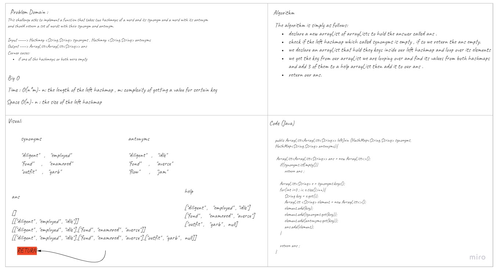

# Hashmap LEFT JOIN
<!-- Short summary or background information -->
LEFT JOIN means all the values in the first hashmap are returned, and if values exist in the “right” hashmap, they are appended to the result row otherwise a null will be added in-pace.
## Challenge
<!-- Description of the challenge -->
This challenge asks to implement a function that takes two hashmaps of a word and its synonym and a word with its antonym and should return a set of words with their synonym and antonym.

## Approach & Efficiency
<!-- What approach did you take? Why? What is the Big O space/time for this approach? -->
For my approach I looped over the first hashmap (left hashmap )that has words and their synonyms and add them to a list and add the antonym of that word if exists in the right hashmap.
Then I add that arrayList to the answer arrayList of arrayLists , finally I return the answer. 
Complexity of my solution takes O(n)- n : the size of the left hashmap - for the space complexity and O(n*m)- n: the length of the left hashmap , m: complexity of getting a value for certain key - for time complexity.

## Solution
<!-- Embedded whiteboard image -->

