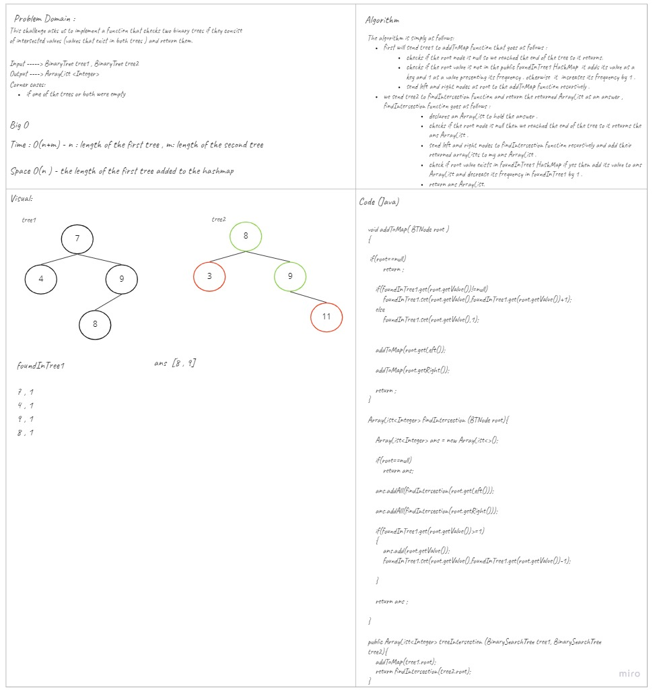

# Challenge Summary
<!-- Description of the challenge -->
This challenge asks us to implement a function that checks two binary trees if they consist of intersected values (values that exist in both trees ) and return them.

## Whiteboard Process
<!-- Embedded whiteboard image -->

## Approach & Efficiency
<!-- What approach did you take? Why? What is the Big O space/time for this approach? -->
Time : O(n+m) - n : length of the first tree , m: length of the second tree 
since we loop over both trees .
Space : O(n ) - the length of the first tree added to a new hashmap. 

## Solution
<!-- Show how to run your code, and examples of it in action -->
To test my code you can run my unit tests or use in by declaring an instance and call the function as follows:  
````
TreeIntersection treeIntersection = new TreeIntersection();
ArrayList<Integer> actual = treeIntersection.treeIntersection(tree1,tree2);
````