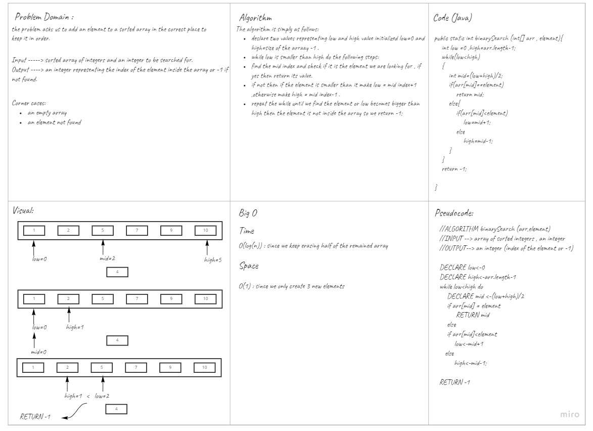

# array-binary-search
<!-- Description of the challenge -->
The challenge  asks us to look for an element inside a sorted array and return its index , and return -1 if not found.
## Whiteboard Process
<!-- Embedded whiteboard image -->

## Approach & Efficiency
<!-- What approach did you take? Discuss Why. What is the Big O space/time for this approach? -->
