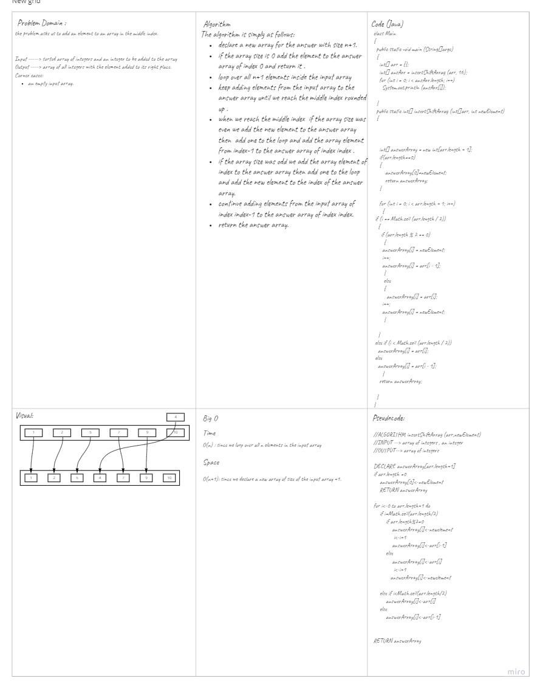

# array-insert-shift
<!-- Description of the challenge -->
The challenge  asks us to add an element to a sorted array in the correct place to keep it in order.
## Whiteboard Process
<!-- Embedded whiteboard image -->

## Approach & Efficiency
<!-- What approach did you take? Discuss Why. What is the Big O space/time for this approach? -->
I took the approach to simply loop over the input array and check if the added value is still bigger than the element in the array I will add the element in the array to the answer array.  
when I find the first element bigger than the new element I add the new element then the first bigger element by increasing the value of the loop counter.
after that I add the remaining elements to the array.  
to know that this is the first bigger element I used a boolean falg with initial value false and when I find the value I turn it into true.