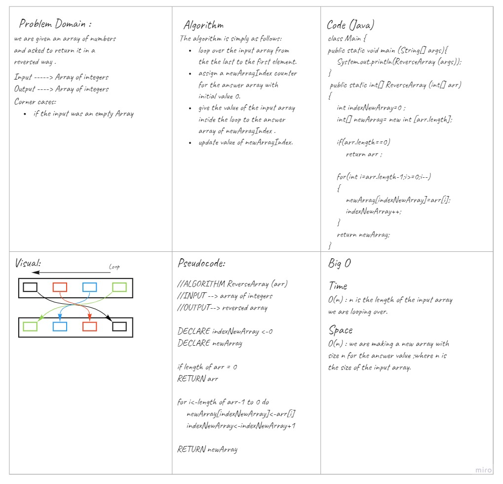

# Reverse an Array
<!-- Description of the challenge -->
The challenge wants us to create `ReverseArray` method that takes an array of integers and reverses it wothout using built in functions. 

## Whiteboard Process
<!-- Embedded whiteboard image -->

## Approach & Efficiency
<!-- What approach did you take? Discuss Why. What is the Big O space/time for this approach? -->
I took the approach to simply loop over the input array and assign its values to the newArray in the proper index for it to be reversed. 
It takes ***O(n)*** time since we are looping over all the array and takes ***O(n)*** memory because we are making a new array with size n for the answer value ;where n is the size of the input array. 