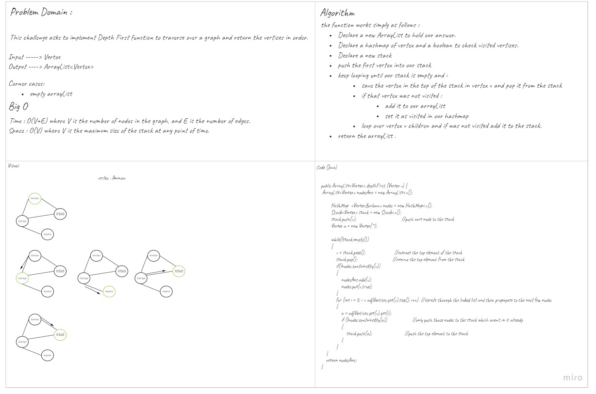

# Depth First Traversal
<!-- Short summary or background information -->
Depth First Traversal is an algorithm that travers over graphs and give the priority for the depth. 

## Challenge
<!-- Description of the challenge -->
This challenge asks to implement Depth First function to traverse over a graph and return the vertices in order.

## Approach & Efficiency
<!-- What approach did you take? Why? What is the Big O space/time for this approach? -->
Time complexity for DepthFirst algorithm is O(V+E) where V is the number of nodes in the graph, and E is the number of edges.
Space complexity is O(V) where V is the maximum size of the stack at any point of time.

## Solution
<!-- Embedded whiteboard image -->
