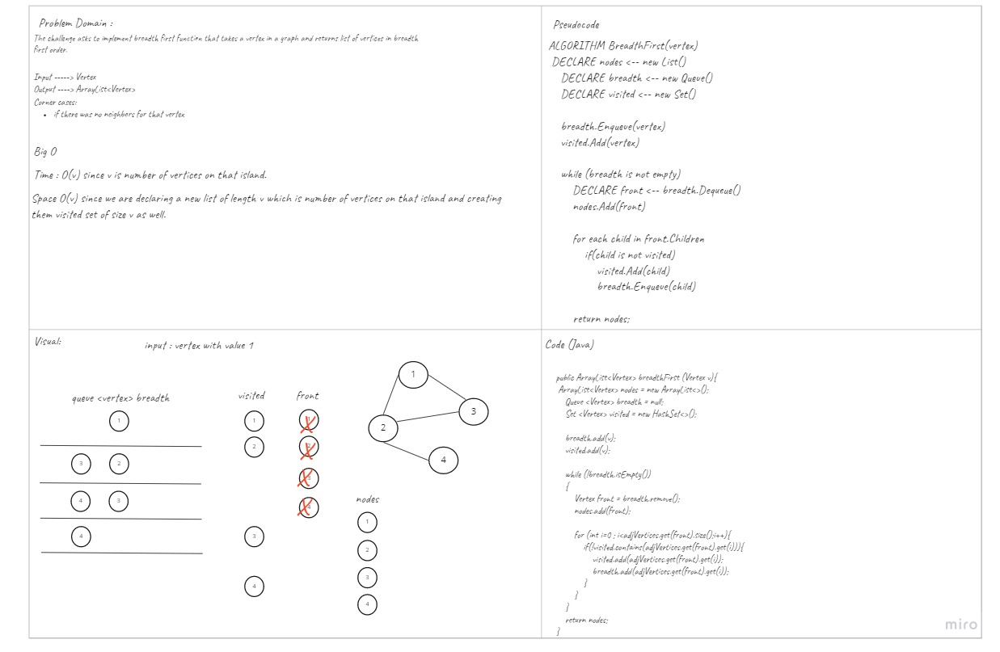

# Challenge Summary
<!-- Description of the challenge -->
The challenge asks to implement breadth first function that takes a vertex in a graph and returns list of vertices in breadth first order.
## Whiteboard Process
<!-- Embedded whiteboard image -->

## Approach & Efficiency
<!-- What approach did you take? Why? What is the Big O space/time for this approach? -->
Time complexity for breath first function is O(v) since v is number of vertices on that island.
Space complexity is O(v) since we are declaring a new list of length v which is number of vertices on that island and creating them visited set of size v as well.
## Solution
<!-- Show how to run your code, and examples of it in action -->
you can use this function by declaring a graph and adding vertices and edges to it then call `graphName.breadthFirst(vertex)`.
