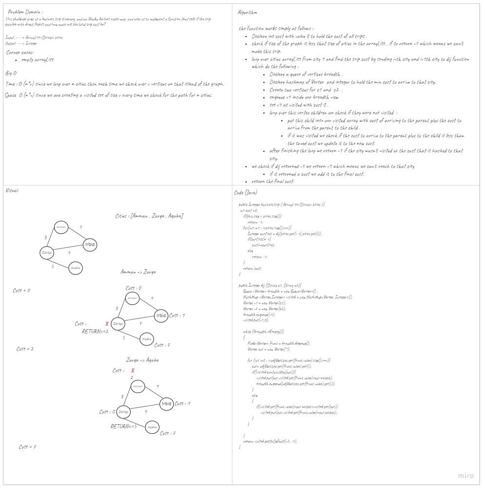

# Challenge Summary
<!-- Description of the challenge -->
This challenge gives us a business trip itinerary, and an Alaska Airlines route map,and asks us to implement a function that tells if the trip possible with direct flights and how much will the total trip cost be?
## Whiteboard Process
<!-- Embedded whiteboard image -->

## Approach & Efficiency
<!-- What approach did you take? Why? What is the Big O space/time for this approach? -->
The complexity for my function is as follows:
- Space : O (n*v)  since we are creating a visited set of size v every time we check for the path for n cities. 
- Time : O (n*v)  since we loop over n cities then each time we check over v vertices on that island of the graph.

## Solution
<!-- Show how to run your code, and examples of it in action -->
you can use this function by declaring a graph and adding vertices and edges to it then call `graphName.businessTrip(ArrayList <String> cities)`.
