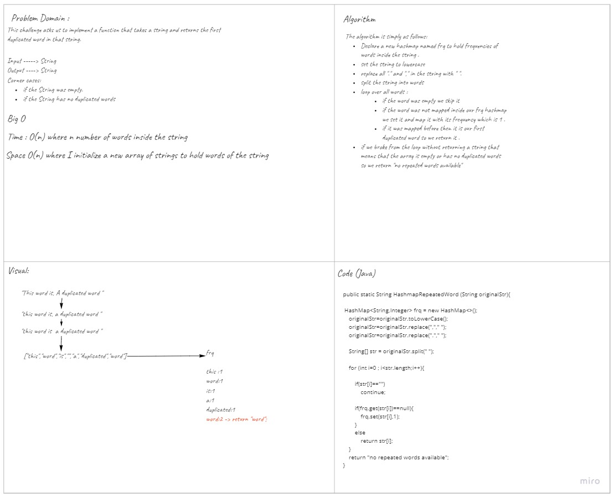

# Challenge Summary
<!-- Description of the challenge -->
This challenge asks us to implement a function that takes a string and returns the first duplicated word in that string. 
## Whiteboard Process
<!-- Embedded whiteboard image -->

## Approach & Efficiency
<!-- What approach did you take? Why? What is the Big O space/time for this approach? -->
To solve this challenge I started by splitting the string into words then I mapped each word with an integer representing its frequency inside the string and when I find a word that is duplicated I return it to be the answer.
This function takes O(n) space complexity since I declare a new array of strings to hold the words and O(n) speed complexity since I loop over all n words inside the string. 
You can view the code from [here](https://baraahabusara.github.io/data-structures-and-algorithms/hashtable/app/src/main/java/hashtable/App.java)
## Solution
<!-- Show how to run your code, and examples of it in action -->
To use this function you can simply call it and send a string inside it as follows:
`HashmapRepeatedWord(string)`  
or you can run `./gradlew run`  to run the test cases. 