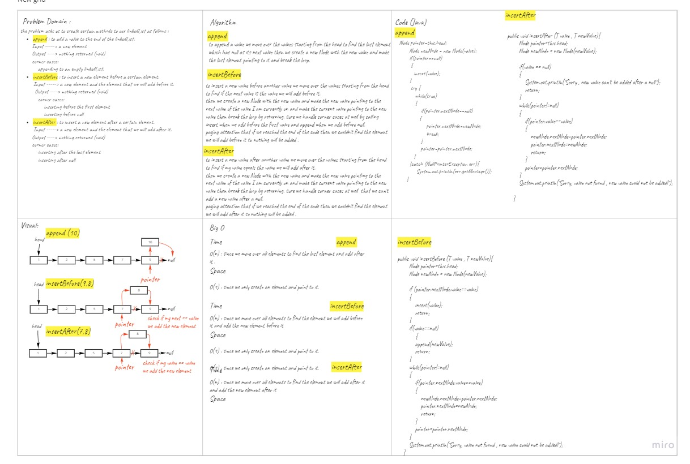
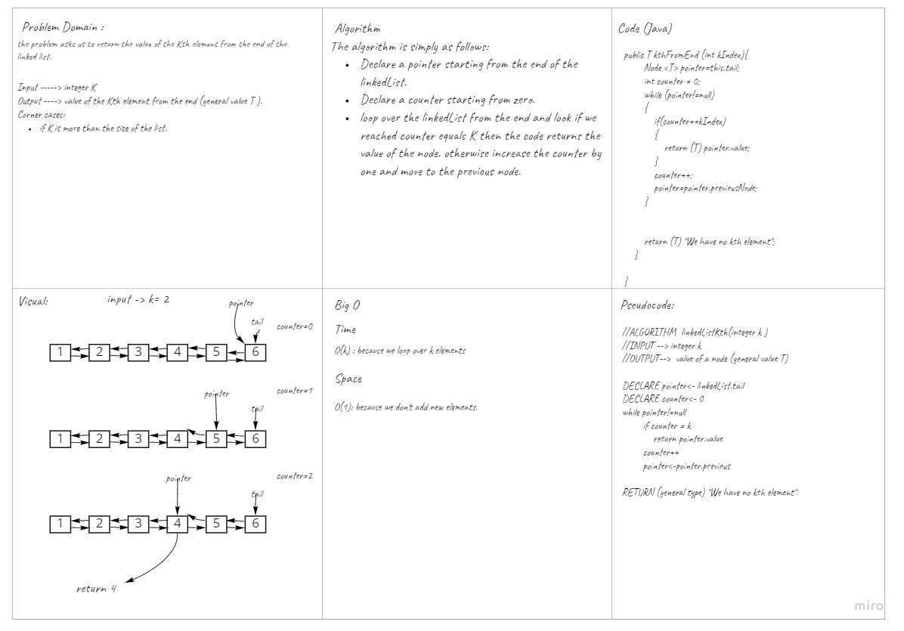
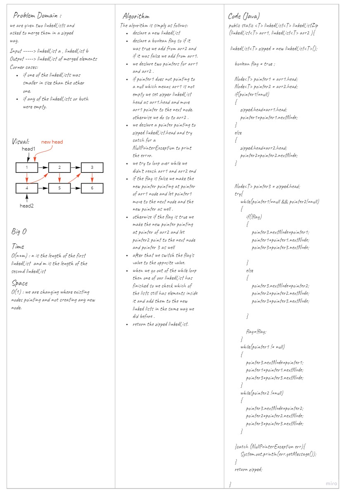

# Singly Linked List
Singly linked list is a class that has a value and a pointer that is pointing to the next element.
it has a pointer pointing to the head of the list to be able to loop over using its pointer and nextNode function.

## Challenge
<!-- Description of the challenge -->
The challenge asks us to create a linkedList class with a value and a pointer pointing to the next element and add :
- insert method .
- includes method : returns a true or false if it found/didn't find a certain value in the linkedList.
- toString: returns all elements of the linkedList in a certain format.
- append: adds a value to the end of the linked list.
- insertBefore: adds a newValue before a value.
- insertAfter: add a newValue after a value.
- DeleteValue: deletes a value from the linked list.
- kthFromEnd: returns the value of the kth element from the tail of the linkedList.
- linkedListZip:  takes two linkedLists and returns a merged linkedList of merging them in a Zipped order as a->b->a->b.
## Whiteboard Process
<!-- Embedded whiteboard image -->

## Approach & Efficiency
<!-- What approach did you take? Why? What is the Big O space/time for this approach? -->
- declare a linkedList : Time complexity O(1) , Memory complexity O(1).
- insert: Time complexity O(1) , Memory complexity O(1).
- includes: Time complexity O(n) , Memory complexity O(1).
- toString: Time complexity O(n) , Memory complexity O(n).
- append: Time complexity O(1) , Memory complexity O(1).
- insertBefore: Time complexity O(n) , Memory complexity O(1).
- insertAfter: Time complexity O(n) , Memory complexity O(1).
- DeleteValue: Time complexity O(n) , Memory complexity O(1).
- kthFromEnd : Time complexity O(k) , Memory complexity O(1).
- linkedListZip : Time complexity O(n+m) , Memory complexity O(1).
## API
<!-- Description of each method publicly available to your Linked List -->

My code is able to do following functionalities publicly: 

- [x] declare a linkedList.
- [x] insert: adds elements into the beginning of the linked list.
- [x] includes: returns true when finding a value within the linked list that exists ,and return false when searching for a value in the linked list that does not exist.
- [x] toString: returns a collection of all the values that exist in the linked list using.
- [x] append: adds a value to the end of the linked list.
- [x] insertBefore: adds a newValue before a value. 
- [x] insertAfter: add a newValue after a value.
- [x] DeleteValue: deletes a value from the linked list. 
- [x] kthFromEnd: returns the value of the kth element from the tail of the linkedList.
- [x] linkedListZip: takes two linkedLists and returns a merged linkedList of merging them in a Zipped order as a->b->a->b. 

