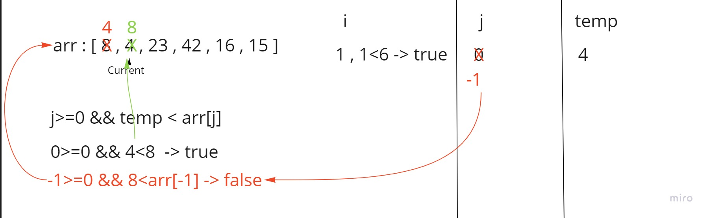
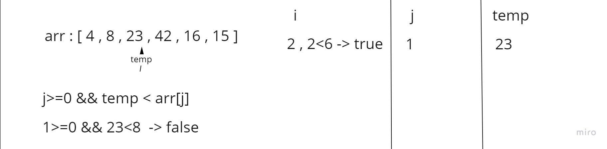
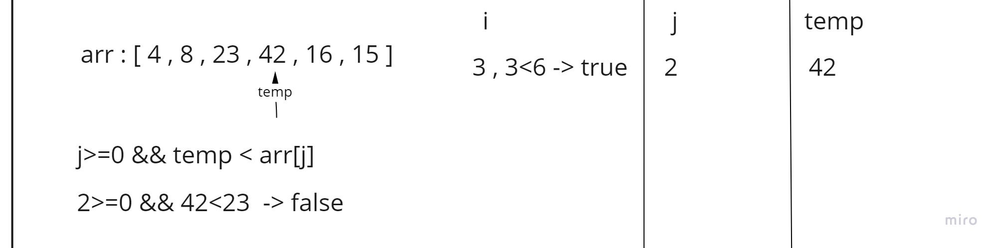
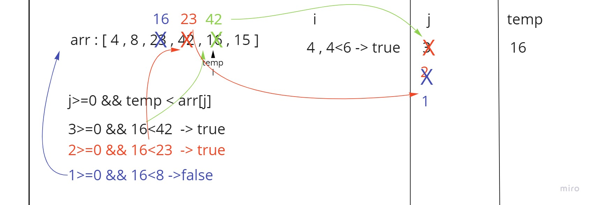
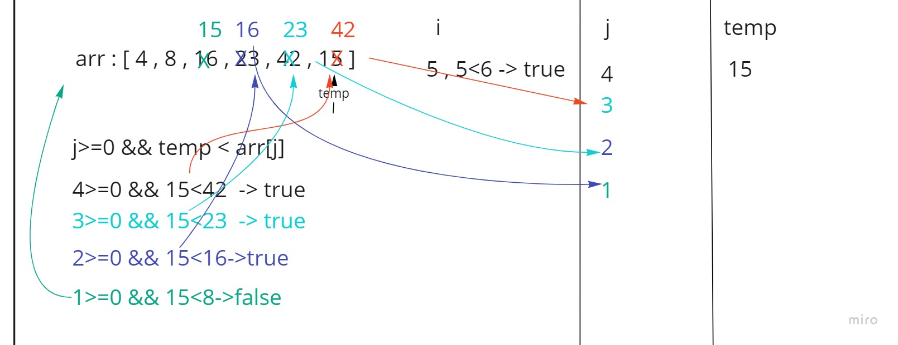
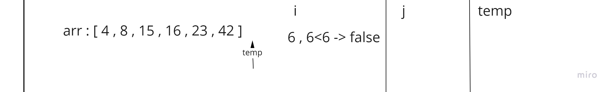

# Insertion Sort 

Insertion sort is a sorting algorithm that loops over all elements of the array and compares the current element with the first element to its left , if it was smaller than it then we swap between them and check again with its left until the element becomes bigger than or equals to its left then we go and check the next element.  
The algorithm keep working until it finishes the last element with **speed complexity of O(n^2)**.

## Pseudocode

````
  InsertionSort(int[] arr)

    FOR i = 1 to arr.length

      int j <-- i - 1
      int temp <-- arr[i]

      WHILE j >= 0 AND temp < arr[j]
        arr[j + 1] <-- arr[j]
        j <-- j - 1

      arr[j + 1] <-- temp
````

## Trace
Sample array : `[8,4,23,42,16,15]`

**Pass 1:**  

In the first step first we assign j equals i-1 which is 0 
we set the current i-th element inside temp which is 4 
then we go to the comparison loop and check if j is more than 0 and temp (4) is less than the j-th element (8) 
since that was true then we shift the left element to the right by one step and decrease the value of j by one .  
then j becomes -1 ,so we go out of the loop and set temp in its place inside arr[j+1].  
**Pass 2:**  

in this step the value inside the temp is already more than its left ,so it is in its right position for now.  
**Pass 3:**  

in this step the value inside the temp is already more than its left ,so it is in its right position for now.  

**Pass 4:**  

In step 4 first we set the i-th(4) element inside temp which is 16
then we go to the comparison loop and check if j (3) is more than 0 and temp (16) is less than the j-th element (42)
    - since that was true then we shift the left element to the right by one step and decrease the value of j by one (2).  
    - since j (2) is still more than 0 and temp (16) is less than j-th element (23) we shift the left element to the right by one step and decrease the value of j by one (1).  

then temp becomes more than j-th element (8) ,so we go out of the loop and set temp in its place inside arr[j+1].
**Pass 5:**  

In step 5 first we set the i-th(5) element inside temp which is 15
then we go to the comparison loop and check if j (4) is more than 0 and temp (15) is less than the j-th element (42)
- since that was true then we shift the left element to the right by one step and decrease the value of j by one (3).  
- since j (3) is still more than 0 and temp (15) is less than j-th element (23) we shift the left element to the right by one step and decrease the value of j by one (2).
- since j (2) is still more than 0 and temp (15) is less than j-th element (16) we shift the left element to the right by one step and decrease the value of j by one (1).

then temp becomes more than j-th element (8) ,so we go out of the loop and set temp in its place inside arr[j+1].
**Pass 6:**  

In this step the current is pointing out of the array so our work sorting the array is done. 

## Efficiency
- Time: O(n^2)
  - The basic operation of this algorithm is comparing the current element to its left until current becomes bigger than the element to its left. This in worst case will happen n * (n-1) number of times…concluding the algorithm to be n squared.
- Space: O(1)
  - No additional space is being created. This array is being sorted in place…keeping the space at constant O(1).

