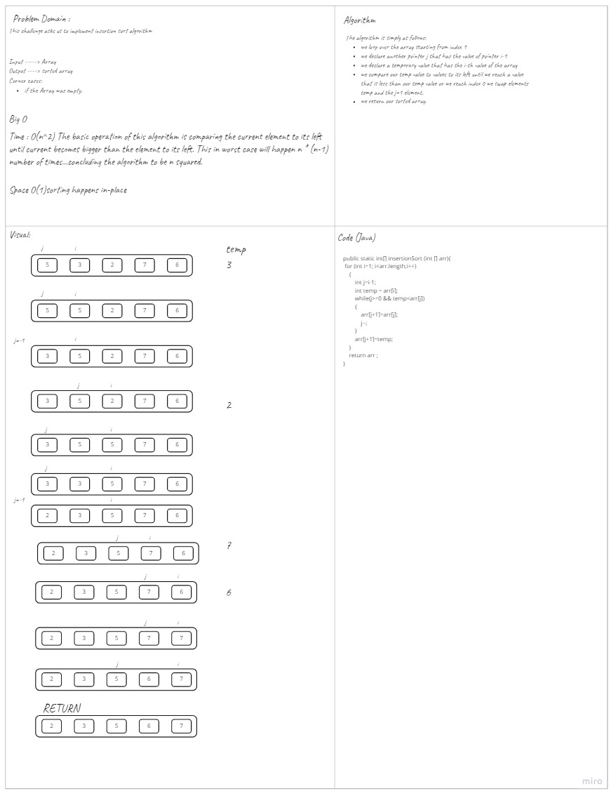

# Challenge Summary
<!-- Description of the challenge -->
This Challenge is asking me to sort an array using insertion sort algorithm. 
## Whiteboard Process
<!-- Embedded whiteboard image -->

## Approach & Efficiency
<!-- What approach did you take? Why? What is the Big O space/time for this approach? -->
Insertion sort is a sorting algorithm that loops over all elements of the array and compares the current element with the first element to its left , if it was smaller than it then we swap between them and check again with its left until the element becomes bigger than or equals to its left then we go and check the next element.  
The algorithm keep working until it finishes the last element.

## Solution
<!-- Show how to run your code, and examples of it in action -->
- Time: O(n^2)
    - The basic operation of this algorithm is comparing the current element to its left until current becomes bigger than the element to its left. This in worst case will happen n * (n-1) number of times…concluding the algorithm to be n squared.
- Space: O(1)
    - No additional space is being created. This array is being sorted in place…keeping the space at constant O(1).

