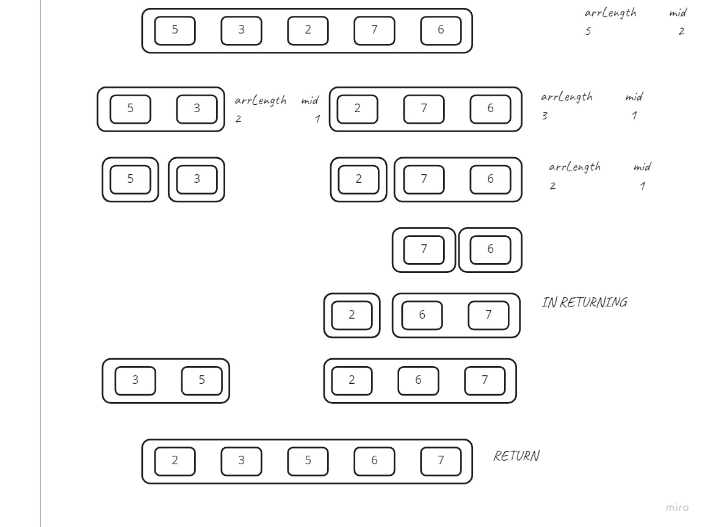

# Merge Sort 
Merge sort is a sorting algorithm that divides the array into two parts recursively until we have individual elements then we sort each half and return until we have the full array back sorted.

## Pseudocode
````
ALGORITHM Mergesort(arr)
    DECLARE n <-- arr.length

    if n > 1
      DECLARE mid <-- n/2
      DECLARE left <-- arr[0...mid]
      DECLARE right <-- arr[mid...n]
      // sort the left side
      Mergesort(left)
      // sort the right side
      Mergesort(right)
      // merge the sorted left and right sides together
      Merge(left, right, arr)

ALGORITHM Merge(left, right, arr)
    DECLARE i <-- 0
    DECLARE j <-- 0
    DECLARE k <-- 0

    while i < left.length && j < right.length
        if left[i] <= right[j]
            arr[k] <-- left[i]
            i <-- i + 1
        else
            arr[k] <-- right[j]
            j <-- j + 1

        k <-- k + 1

    if i = left.length
       set remaining entries in arr to remaining values in right
    else
       set remaining entries in arr to remaining values in left
````
## Trace

In the picture you can see how we split our array in the first part of the code to a left and right arrays recursively until we reach arrays of one element.
then we sort left and right arrays and merge them then return the merged array until we reach our full array and return it. 
## Efficiency
- Time: O(nlog(n))
  - The basic operation of this algorithm is dividing the array into two parts recursively until we have individual elements then we sort each half and return until we have the full array back sorted. 
- Space: O(nlog(n))
  - in each step we declare a new array with length of half of the previous array. 
  
