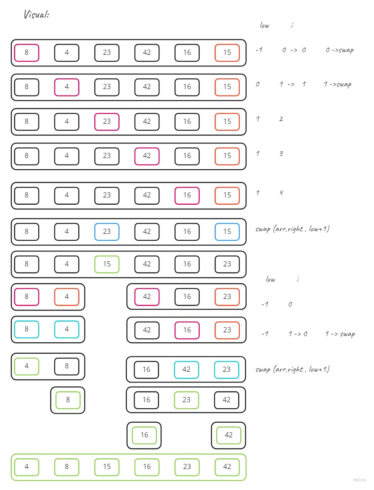

# Quick Sort 
Quick sort is a recursive sorting algorithm that takes a number as a pivot and move it to the end of the array,
then trace the array from the left looking for an item that is larger than the pivot and from the right to find an item that is smaller than the pivot
then if the larger item was in index that is less than the smallest item we swap them otherwise we put our pivot back by swapping it to its position.


## Pseudocode
````
ALGORITHM QuickSort(arr, left, right)
    if left < right
        // Partition the array by setting the position of the pivot value
        DEFINE position <-- Partition(arr, left, right)
        // Sort the left
        QuickSort(arr, left, position - 1)
        // Sort the right
        QuickSort(arr, position + 1, right)

ALGORITHM Partition(arr, left, right)
    // set a pivot value as a point of reference
    DEFINE pivot <-- arr[right]
    // create a variable to track the largest index of numbers lower than the defined pivot
    DEFINE low <-- left - 1
    for i <- left to right do
        if arr[i] <= pivot
            low++
            Swap(arr, i, low)

     // place the value of the pivot location in the middle.
     // all numbers smaller than the pivot are on the left, larger on the right.
     Swap(arr, right, low + 1)
    // return the pivot index point
     return low + 1

ALGORITHM Swap(arr, i, low)
    DEFINE temp;
    temp <-- arr[i]
    arr[i] <-- arr[low]
    arr[low] <-- temp
````

## Trace
Sample array : `[8,4,23,42,16,15]`


## Efficiency
- Time: O(n*log(n))
  - This happens when the pivot we choose is always an extreme (smallest or largest element)
- Space: O(1)
  - we are sorting the array in place. 

