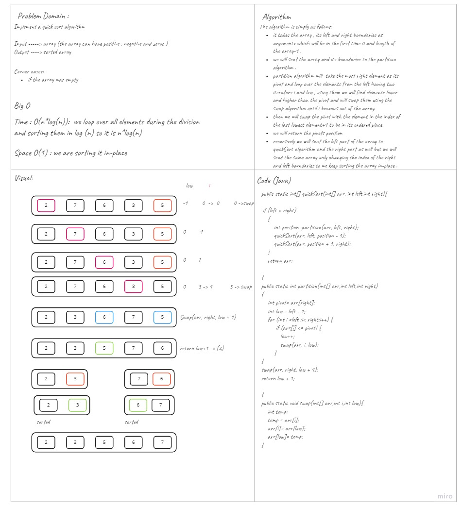

# Challenge Summary
<!-- Description of the challenge -->
This challenge asks me to sort an array using quick sort algorithm.
## Whiteboard Process
<!-- Embedded whiteboard image -->

## Approach & Efficiency
<!-- What approach did you take? Why? What is the Big O space/time for this approach? -->
Quick sort is a recursive sorting algorithm that takes a number as a pivot and move it to the end of the array,
then trace the array from the left looking for an item that is larger than the pivot and from the right to find an item that is smaller than the pivot
then if the larger item was in index that is less than the smallest item we swap them otherwise we put our pivot back by swapping it to its position.

## Solution
<!-- Show how to run your code, and examples of it in action -->
- Time: O(n*log(n))
    - This is the average case , we loop over all elements during the division and sorting them in log (n) so it is n*log(n). 
    - it goes to O(n) in worst case when the pivot is chosen to be always the highest/lowest number. 
- Space: O(1)
  - sorting happens in-place   
