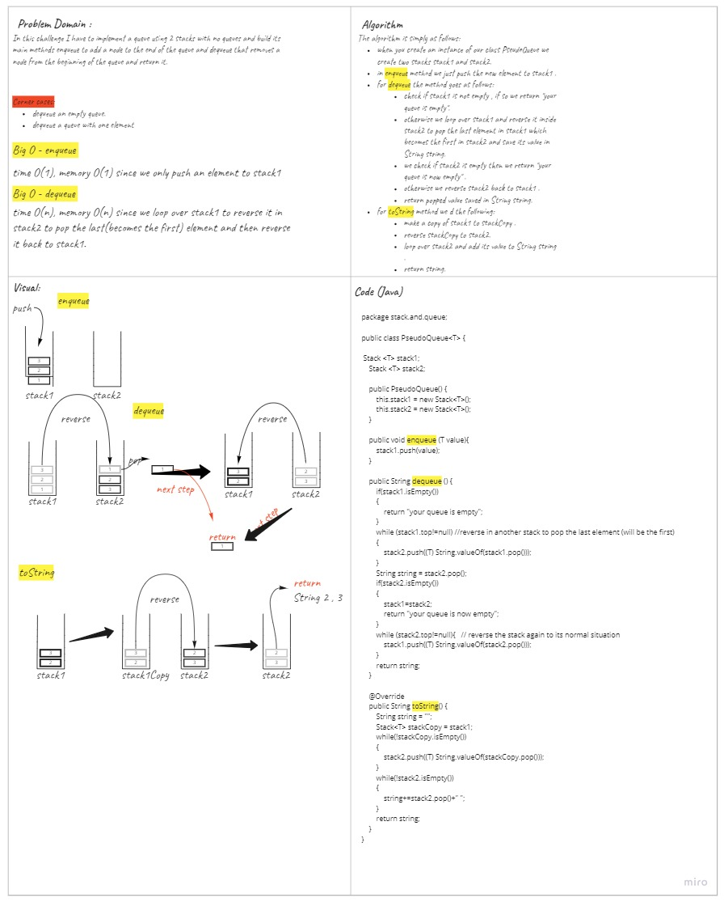

# Challenge Summary
<!-- Description of the challenge -->
This challenge asks us to implement a PseudoQueue using 2 Stacks in order to enqueue and dequeue successfully to the queue within FIFO approach. 
## Whiteboard Process
<!-- Embedded whiteboard image -->

## Approach & Efficiency
<!-- What approach did you take? Why? What is the Big O space/time for this approach? -->
For my code I used stack1 to save the data in general and stack2 to reverse the data in when needed.
My approach's time and memory complexity goes as follows:
- enqueue : time O(1), memory O(1) since we only push an element to stack1.
- dequeue : time O(n), memory O(n) since we loop over stack1 to reverse it in stack2 to pop the last(becomes the first) element and then reverse it back to stack1.
- toString : time O(n), memory O(n) since we make a copy of stack1 and reverse that copy in stack2 to print it in the correct order.
## Solution
<!-- Show how to run your code, and examples of it in action -->
To run my code you can use :
- To initialize a new PseudoQueue :  
`PseudoQueue<variableType> pQname = new PseudoQueue<variableType>();`
- To enqueue a new value :  
`pQname.enqueue(newValue);`
- To dequeue a value from the PseudoQueue :  
`pQname.dequeue();`  
- and you can save the enqueued value into a variable.
