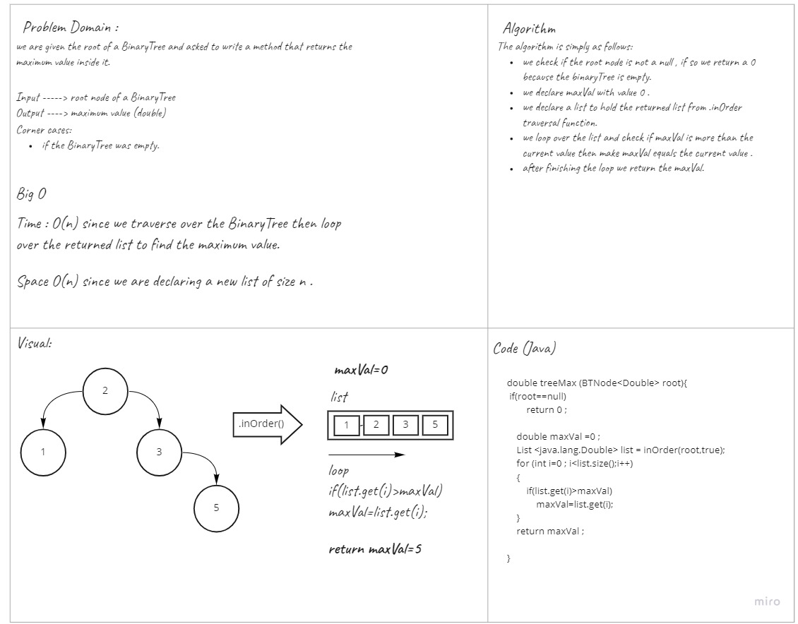

# Challenge Summary
<!-- Description of the challenge -->
This challenge asks us to implement a treeMax function which finds the maximum value in a binary tree. 
## Whiteboard Process
<!-- Embedded whiteboard image -->

## Approach & Efficiency
<!-- What approach did you take? Why? What is the Big O space/time for this approach? -->
In my code I used traversal method `inOrder()` to have a list with all elements in the tree then I looped over the list to find the maximum value between them . 
This method takes O(n) memory complexity because I am declaring a new list of size n and O(n) speed complexity because I loop over the tree elements in the inOrder method once, and I loop over the list one more time. 
## Solution
<!-- Show how to run your code, and examples of it in action -->
To rum this method you have to make a new `BinaryTree` or a new `BinarySearchTree` and call the `.treeMax(tree.root)` method.
And you can test my application using `./gradlew run` command. 